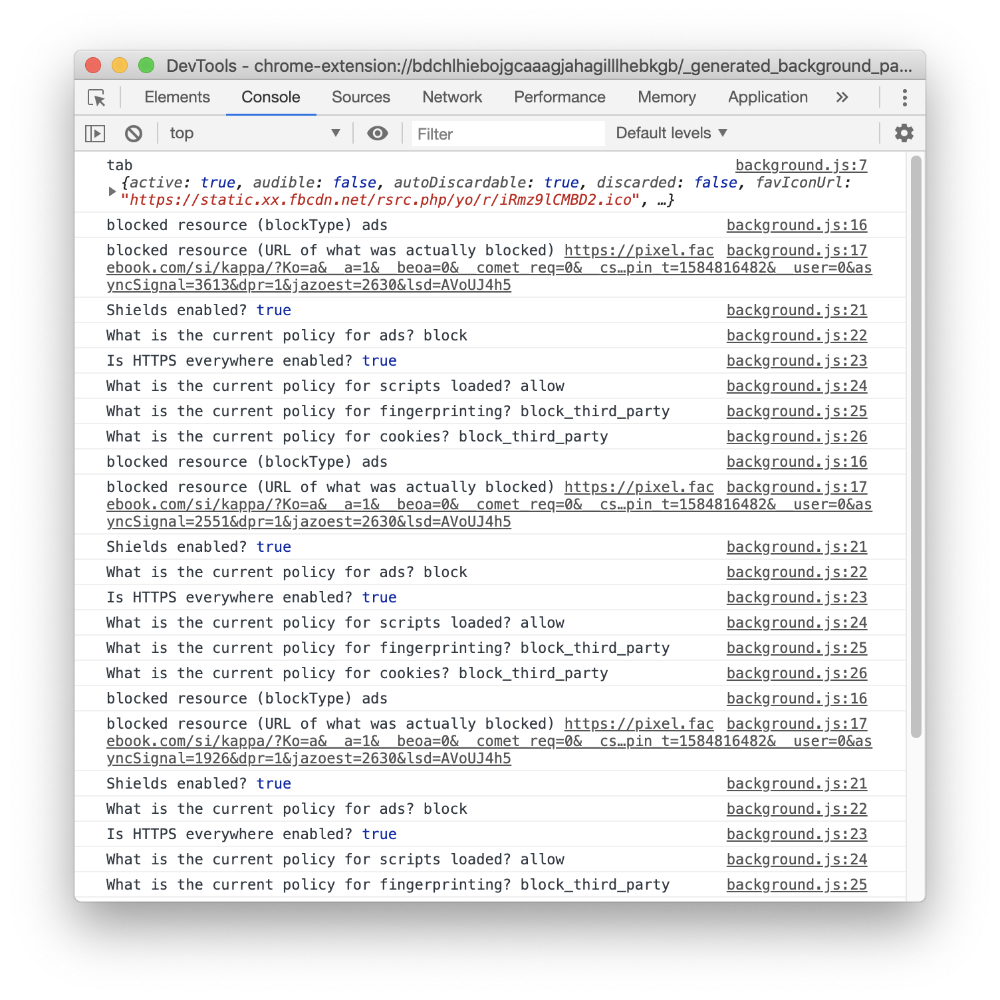

# Matt stats extension example

Sample extension to fetch privileged Brave Shields data

## Usage

1. brave://extensions, toggle "developer mode."
2. Load this extension

This extension loads a background page that logs relevant information about the active tab page data for Shields, mainly resources blocked.

### To see the logs

1. Go to brave://inspect/#extensions and click `inspect`
2. Go to an `http`/`https` website
3. Click the browser action
4. Devtools opened in step 1 should show the current tab data. Wait a few seconds to give it time to load (async) the relevant data.
5. Profit :tada:
